<h1 align="center">demo-reel</h1>

<p align="center">
  <strong>AI launch video and viral reel generator for coding agents.</strong><br>
  Turn any repo, website, or screen recording into launch videos for TikTok, Instagram Reels, YouTube Shorts, LinkedIn, and X.
  Every render has to pass 51 automated quality gates before it ships.
</p>

<p align="center">
  <a href="LICENSE"></a>
  
  
  
</p>

<p align="center">
  <a href="docs/assets/demo-reel-launch-video.mp4">
    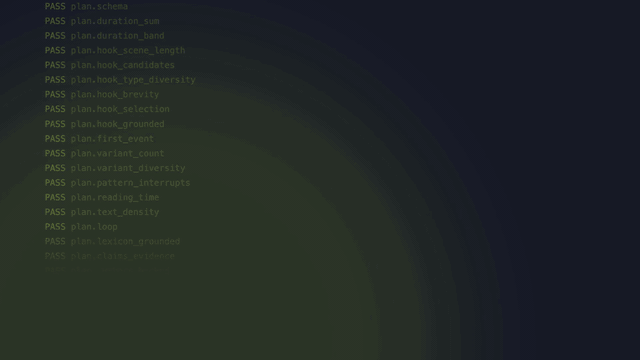
  </a>
</p>
<p align="center">
  <sub>demo-reel made this video of its own repo.
  <a href="docs/assets/demo-reel-launch-video.mp4">Watch with sound (16:9 MP4)</a> ·
  <a href="docs/case-studies/demo-reel/reel-A-vertical.mp4">9:16 version</a> ·
  <a href="docs/case-studies/demo-reel/qa-report.md">QA report: VRS 100 on 9/9 renders</a></sub>
</p>

<p align="center">
  <a href="#install">Install</a> ·
  <a href="#use">Use</a> ·
  <a href="skills/demo-reel/references/case-studies.md">Case studies</a> ·
  <a href="skills/demo-reel/references/metrics.md">51 gates</a> ·
  <a href="skills/demo-reel/references/faq.md">FAQ</a>
</p>

## What is demo-reel?

An open-source **Agent Skill** that makes **launch videos and short-form reels** for software projects. Run `/demo-reel`
in Claude Code, Codex CLI, GitHub Copilot, Cursor, or any agent that supports skills. The agent:

1. Writes 10+ hooks from your code.
2. Renders the best 3 in 9:16, 1:1, and 16:9.
3. Ships only renders that pass **51 machine-verified gates**.

After launch, `reel.py learn` picks the winning hook from your real analytics.

## 12 launch reels, 12 trending AI repos

Made by `/demo-reel` for 12 of this month's trending AI repositories on GitHub. Each reel shows one headline feature using the repo's own site, screenshots, and demo footage, in its brand fonts and colors. Every number on screen quotes its README. Each repo was rendered in all three formats, and all 36 renders passed the 51 gates with zero failures (VRS 100; 1–2 format-specific gates don't apply per render). Click a preview to watch with sound; the score opens the QA report.

<table>
<tr><td colspan="4"><b>16:9 · landscape</b></td></tr>
<tr>
<td align="center" width="25%"><a href="docs/showcase/archify/archify-landscape.mp4">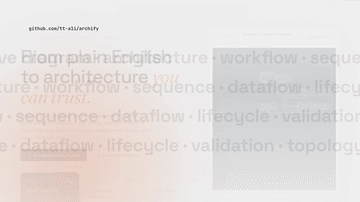</a><br><a href="https://github.com/tt-a1i/archify"><b>tt-a1i/archify</b></a><br><sub><a href="docs/showcase/archify/qa-report.md">VRS 100</a></sub></td>
<td align="center" width="25%"><a href="docs/showcase/open-code-review/open-code-review-landscape.mp4">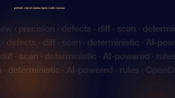</a><br><a href="https://github.com/alibaba/open-code-review"><b>alibaba/open-code-review</b></a><br><sub><a href="docs/showcase/open-code-review/qa-report.md">VRS 100</a></sub></td>
<td align="center" width="25%"><a href="docs/showcase/paperclip/paperclip-landscape.mp4">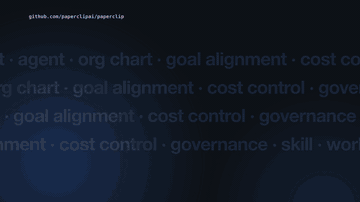</a><br><a href="https://github.com/paperclipai/paperclip"><b>paperclipai/paperclip</b></a><br><sub><a href="docs/showcase/paperclip/qa-report.md">VRS 100</a></sub></td>
<td align="center" width="25%"><a href="docs/showcase/ai-engineering-from-scratch/ai-engineering-from-scratch-landscape.mp4">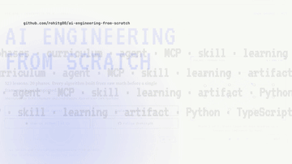</a><br><a href="https://github.com/rohitg00/ai-engineering-from-scratch"><b>rohitg00/ai-engineering-from-scratch</b></a><br><sub><a href="docs/showcase/ai-engineering-from-scratch/qa-report.md">VRS 100</a></sub></td>
</tr>
<tr><td colspan="4"><b>1:1 · square</b></td></tr>
<tr>
<td align="center" width="25%"><a href="docs/showcase/ECC/ECC-square.mp4">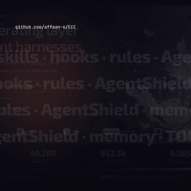</a><br><a href="https://github.com/affaan-m/ECC"><b>affaan-m/ECC</b></a><br><sub><a href="docs/showcase/ECC/qa-report.md">VRS 100</a></sub></td>
<td align="center" width="25%"><a href="docs/showcase/hindsight/hindsight-square.mp4">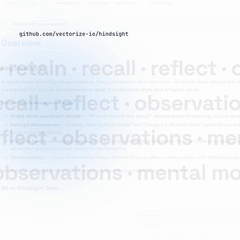</a><br><a href="https://github.com/vectorize-io/hindsight"><b>vectorize-io/hindsight</b></a><br><sub><a href="docs/showcase/hindsight/qa-report.md">VRS 100</a></sub></td>
<td align="center" width="25%"><a href="docs/showcase/scientific-agent-skills/scientific-agent-skills-square.mp4">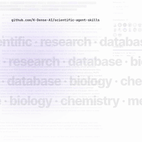</a><br><a href="https://github.com/K-Dense-AI/scientific-agent-skills"><b>K-Dense-AI/scientific-agent-skills</b></a><br><sub><a href="docs/showcase/scientific-agent-skills/qa-report.md">VRS 100</a></sub></td>
<td align="center" width="25%"><a href="docs/showcase/VoiceStudio/VoiceStudio-square.mp4">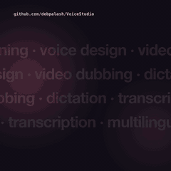</a><br><a href="https://github.com/debpalash/VoiceStudio"><b>debpalash/VoiceStudio</b></a><br><sub><a href="docs/showcase/VoiceStudio/qa-report.md">VRS 100</a></sub></td>
</tr>
<tr><td colspan="4"><b>9:16 · reel</b></td></tr>
<tr>
<td align="center" width="25%"><a href="docs/showcase/ponytail/ponytail-vertical.mp4">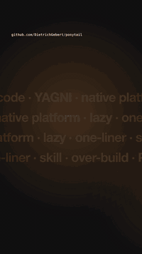</a><br><a href="https://github.com/DietrichGebert/ponytail"><b>DietrichGebert/ponytail</b></a><br><sub><a href="docs/showcase/ponytail/qa-report.md">VRS 100</a></sub></td>
<td align="center" width="25%"><a href="docs/showcase/i-have-adhd/i-have-adhd-vertical.mp4">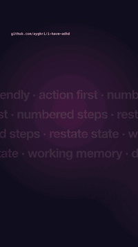</a><br><a href="https://github.com/ayghri/i-have-adhd"><b>ayghri/i-have-adhd</b></a><br><sub><a href="docs/showcase/i-have-adhd/qa-report.md">VRS 100</a></sub></td>
<td align="center" width="25%"><a href="docs/showcase/OpenMAIC/OpenMAIC-vertical.mp4">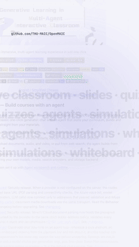</a><br><a href="https://github.com/THU-MAIC/OpenMAIC"><b>THU-MAIC/OpenMAIC</b></a><br><sub><a href="docs/showcase/OpenMAIC/qa-report.md">VRS 100</a></sub></td>
<td align="center" width="25%"><a href="docs/showcase/codex-chatgpt-web/codex-chatgpt-web-vertical.mp4">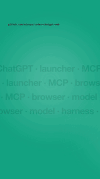</a><br><a href="https://github.com/miuuyy/codex-chatgpt-web"><b>miuuyy/codex-chatgpt-web</b></a><br><sub><a href="docs/showcase/codex-chatgpt-web/qa-report.md">VRS 100</a></sub></td>
</tr>
</table>

<sub>Independent demos made with demo-reel; not affiliated with or endorsed by these projects. Kits (plan, captions, poster, QA report) live in <a href="docs/showcase/">docs/showcase/</a>.</sub>

## Install

```sh
npx skills add https://github.com/shashankswe2020-ux/demo-reel --skill demo-reel
```

Requires Python 3.10+, FFmpeg, and a frame renderer (Playwright, Remotion, Hyperframes, or Pillow).

## Use

```
/demo-reel                                   # current project
/demo-reel https://example.com --tone cinematic
/demo-reel demo-recording.mov --duration 25
```

You get `reel-output/` with 9 videos, posters, captions, share copy, a posting plan, and a QA report.

## Learn more

| Topic | Reference |
|---|---|
| Workflow and creative laws | [SKILL.md](skills/demo-reel/SKILL.md) |
| All 51 gates and scoring | [metrics.md](skills/demo-reel/references/metrics.md) |
| CLI commands and tests | [toolkit.md](skills/demo-reel/references/toolkit.md) |
| Case studies: demo-reel and local-llmup | [case-studies.md](skills/demo-reel/references/case-studies.md) |
| FAQ | [faq.md](skills/demo-reel/references/faq.md) |

Licensed under [Apache 2.0](LICENSE).
