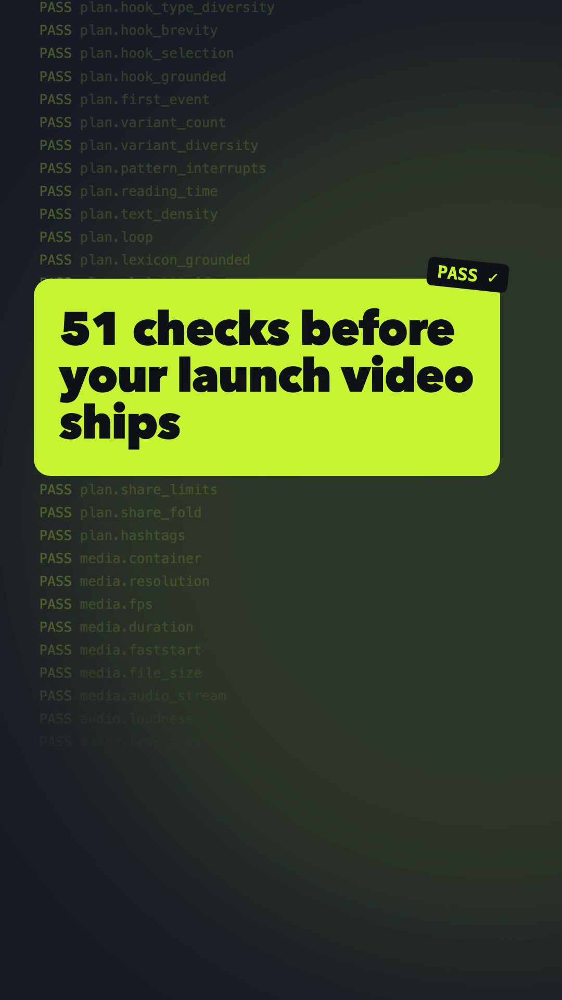
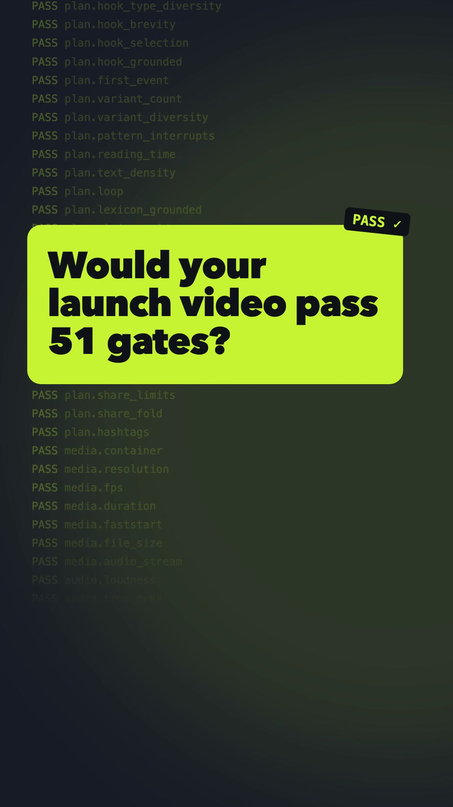
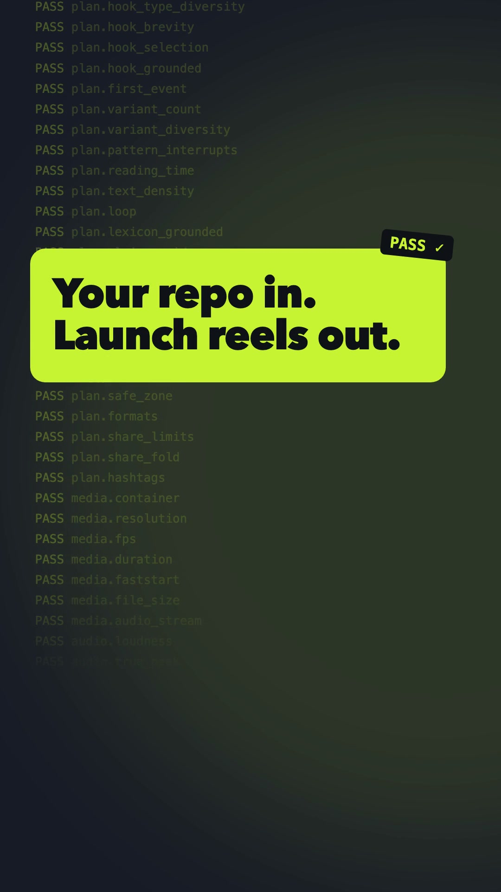
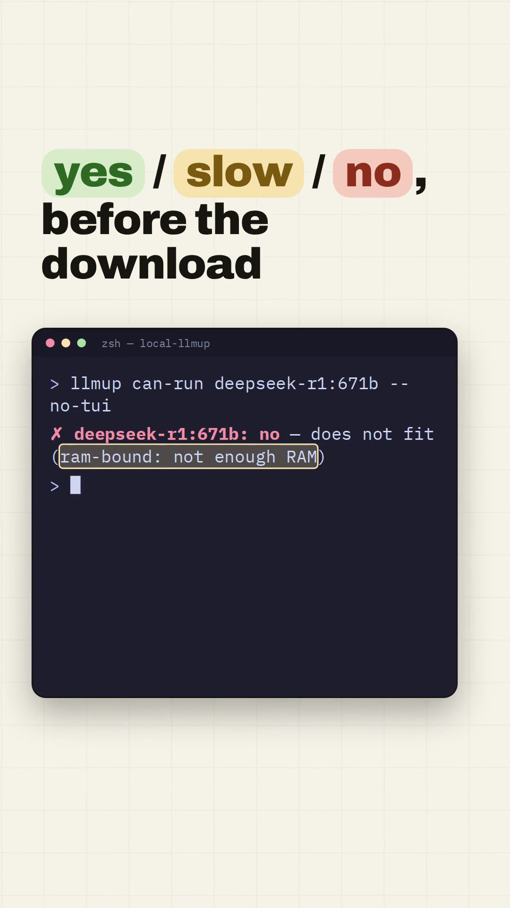
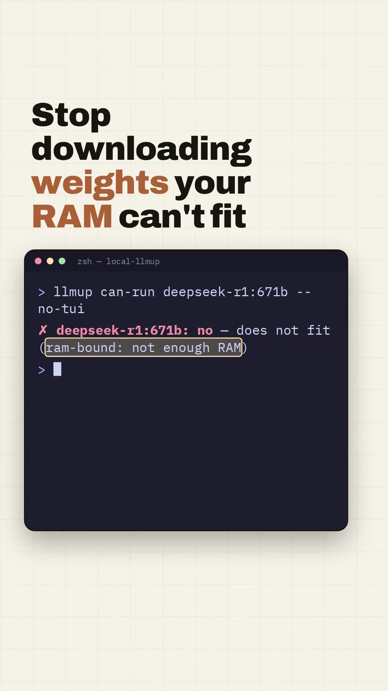
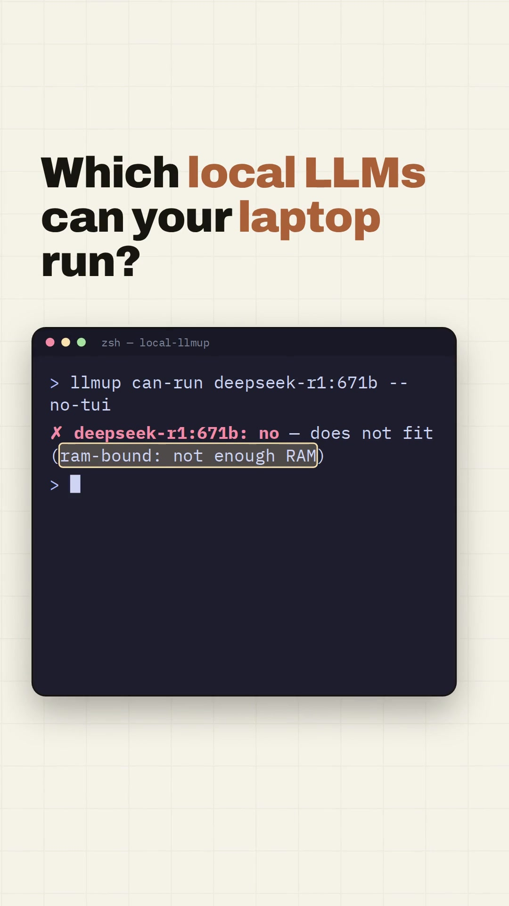

# Case studies

Both runs were produced end-to-end by the skill and rendered with Playwright + FFmpeg. Every number here
comes from the committed `qa-report.json`, so you can check it yourself.

## 1. demo-reel on itself

  
  
  

Watch: [reel-A-vertical.mp4](../../../docs/case-studies/demo-reel/reel-A-vertical.mp4) · Kit: [docs/case-studies/demo-reel/](../../../docs/case-studies/demo-reel/)

| Variant | Hook type | Hook | Hook score |
|---|---|---|---|
| A | statistic | "51 checks before your launch video ships" | 85.6 |
| B | question | "Would your launch video pass 51 gates?" | 83.4 |
| C | demo_first | "Your repo in. Launch reels out." | 80.0 |

- **Plan:** 10 hooks, 5 claims checked verbatim against this repo's source, 7 lexicon terms, 20 s, `terminal` tone, `callback` loop.
- **First gate run: min VRS 91.7, not shippable.** The gates found 4 real defects:
  - `media.container`: `finish` passed full-range `yuvj420p` from the browser frames through to the output. This was a toolkit bug, now fixed and covered by a regression test.
  - `audio.true_peak`: output hit 0.0 dBTP because loudnorm's linear mode added +5.4 dB with no limiter. This was a toolkit bug, now fixed and covered by a regression test.
  - `visual.black_frames`: the dark demo scene in the square cut measured as "black". This was a knock-on of the full-range bug.
  - `captions.readability`: the hook cue merged with an overlapping subline (24.5 chars/s), and the CTA cue held too briefly (23.3 chars/s). Fixed by editing the plan and composition.
- **Final: 9/9 renders at VRS 100 over 227 gate evaluations.** Measured on every render: −14.4 LUFS, −2.4 dBTP, first motion at 0.07 s, longest static stretch ≤ 1.97 s, 2.9–4.2 MB.
- **Sound fix after review:** the first soundtrack passed every audio gate but was unpleasant to listen to. It was rebuilt with smooth sound edges, a warm electric-piano bed, low-passed percussion, thinned SFX, and a small room reverb. The top band (above 8 kHz) dropped from −15.9 to −32.0 LU against the full mix, and click peaks above 12 kHz dropped from −17 to −37 dB.
- Re-verify the plan against this repo: `python3 skills/demo-reel/scripts/reel.py lint docs/case-studies/demo-reel/reel-plan.json`

## 2. local-llmup (Rust CLI: "which local LLMs can your computer run?")

  
  
  

Kit: [docs/case-studies/local-llmup/](../../../docs/case-studies/local-llmup/) (plan, QA report, share copy, posting plan, posters)

| Variant | Hook type | Hook | Hook score |
|---|---|---|---|
| A | demo_first | "yes / slow / no, before the download" | 88.6 |
| B | negative | "Stop downloading weights your RAM can't fit" | 88.0 |
| C | question | "Which local LLMs can your laptop run?" | 77.0 |

- **Plan:** 10 hooks across 10 hook types; 4 claims checked verbatim against the local-llmup source (for example "66 models with evidence attached"); 10 lexicon terms (`can-run`, `tok/s`, `Ollama`, …); `terminal` tone. The loop opens on a red `no` verdict and closes on a green `yes`.
- **Product in use:** the demo scene types `llmup can-run` for two models and shows a green `yes` with tok/s, then a red `no`. It is recreated from the project's own `assets/can-run.tape` and screenshot.
- **Result: 9/9 renders at VRS 100 over 227 gate evaluations.** Measured on every render: −14.0 LUFS, −2.4 dBTP, first motion at 0.07 s, 7–8 cuts, longest static stretch ≤ 1.07 s, 3.2–4.1 MB.
- The plan's `project.root` points at the local-llmup repo, so re-run `lint` from a checkout of that project.

Neither case study has post-launch data yet. `metrics.csv` and `reel.py learn` are the next step for both.
